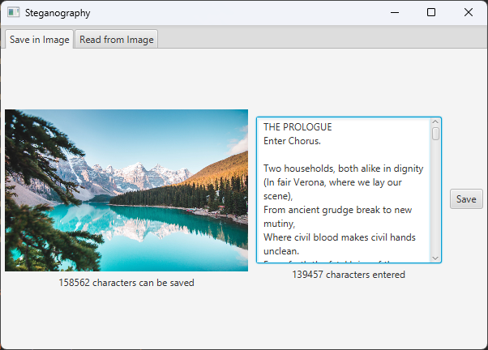
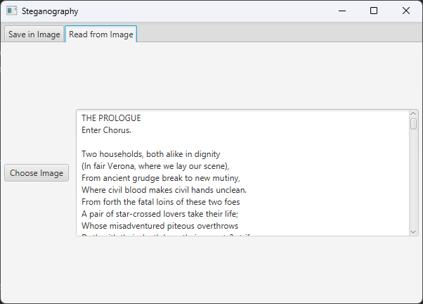

# Steganography
Written in Java with javafx GUI.  

Simple steganography tool that embeds arbitrary text inside an image's pixel-data. This process alters the image slightly, but is basically undetectable in photos unless compared directly to the pixel-data of the original image.

# How it works
- Look at RGB of every pixel
- Edit the strongest color value so that it contains the ascii number of a character of the message
- Only change the color if the change is small enough so its not obvious
- That means some images are more suitable for this appoch than others. 
- For example: 
    - very black and very white areas are bad for saving to
    - patches of single colors are changed to be "noisy"
    - photos are much better than digital art because additional "noise" is much less obvious

# Encoding and Extracting
In this example i used a 720p landscape image. I saved all of  "Romeo and Juliet" within the image.

The text can then get extracted again in the other tab

# Image Comparison
Original Image:

Image with all of Romeo and Juliet encoded inside:

# Source
Example Image: https://www.pexels.com/photo/beautiful-view-of-moraine-lake-2662116/ by Jaime Reimer